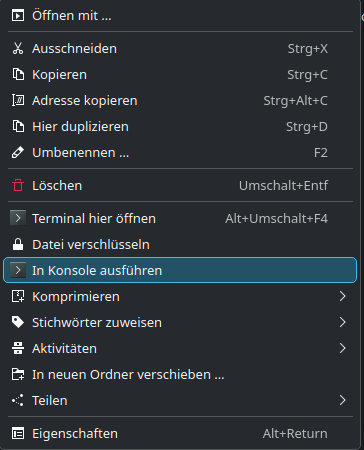

# G13 Linux Driver & GUI (Modernized Fork)

This is a modernized fork of the G13 driver for Linux. 
The original project is over 10 years old. This fork has been refactored to use modern C++ standards for the driver and modern Java standards (Java 17 with Maven) for the configuration GUI.

## Features

* Modern C++ Driver: The core driver has been updated for better performance and compatibility.
* Java GUI: The configuration utility is built with Java 17 and Maven, ensuring it runs on modern systems.
* Flexible Configuration: Offers multiple ways to configure your G13: via the user-friendly GUI, manual file editing, or using the driver's fixed mapping with external tools.

## Requirements

 ### Base Requirements

 * 'make' has to be installed


 ### Driver Requirements
* **`libusb-1.0`**: This library is essential for the driver to communicate with the G13 device. (also the development version)


    * **Debian / Ubuntu**

        ```bash
        sudo apt-get install libusb-1.0-0
        ```
    * **Arch Linux and other Arch based distros**

        ```bash
        sudo pacman -S libusb
        ```

    * **Fedora / Nobara / etc.**
        ```bash
        sudo dnf install libusb1-devel
        ```

### GUI Requirements
* **Java 17 (or higher): The graphical configuration tool requires a Java Runtime Environment.**

    * **Debian / Ubuntu**

        ```bash
        sudo apt-get install default-jre
        ```
    * **Arch Linux and other Arch based distros**

        ```bash
        sudo pacman -S jre-openjdk
        ```

    * **Fedora / Nobara / etc.**
        ```bash
        sudo dnf install java-latest-openjdk.x86_64
        ```


## Build & Installation

* Open the terminal (command prompt) 
* navigate to your download folder
* unzip your download
* enter the folder 'src' in the downloaded file 

    * **building the driver**
        ```bash
        make all
        ```
    * **write the udev-rule**
        ```bash
        make install
        ```


( for cleaning up 
use `make clean`
and `make uninstall`
this will delete the build-files, the driver and the UDEV-Rule. )


## How to use the driver and the GUI App

### Use the driver buildin Mappingset for mapping with other external tools like "Input Remapper"

The driver has now a fixed mapping included, so the GUI is not strictly necessesary. 
You can now map the keys with every other tool, like "Input Remapper".
( Only the quick change with the four small Buttons under the display doesn't work anymore. This works only with the GUI tool.)


### Manually made your own Mappingset

If you don't want to use the GUI App, just copy the Folder ".g13" from /bindings to your 'home' Directory. 
So you can make entries manually in the files.

In the 'docs' folder is an example List for Eventcodes.
* Usage Example:

    If you want to map the G20 key on your G13 to the T key on the keyboard:
    Find T in the table. The Event Code is 20.
    Open your bindings-0.properties file.
    Add or change the following line: G20=p,k.20.


### Use the config tool
  
In a command prompt go to the downloaded and unzipped folder and type:

    java -jar Linux-G13-GUI.jar

or with rightclick on the file in your file-explorer.


This will bring up the UI and create the initial files needed for your driver.  
All config files are saved in `$(HOME)/.g13`


The top 4 buttons under the LCD screen select the bindings.
The joystick currently only supports key mappings

If you are configuring the application while the driver is running, the driver will not pick up changes unless you select a different bindings set or you can restart the driver.


### Run the driver

* **In a command prompt go to the directory where you build the driver**

* If you have set the UDEV Rules, you now can start the driver with 
    ```bash
    ./G13-Linux-Driver 
    ```

    or with rightclick on the file in your file-explorer.

    

* else without UDEV-Rule Installation
    ```bash
    sudo -E ./G13-Linux-Driver
    ```

    The `-E` is to run it using your environment variables so it doesn't look for the `.g13` directory in `/root`  
    If you want to run the command and then detach it so you can close the terminal:
    ```bash
    sudo -E ./G13-Linux-Driver &
    ```


## Notes

I've tried this on 64-bit Arch Linux and it works so far.  