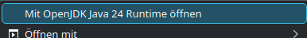

# G13 Linux Driver & GUI (Modernized Fork)

This is a modernized fork of the G13 driver for Linux.
The original project is over 10 years old. This fork has been refactored to use modern C++ standards for the driver and modern Java standards (Java 17 with Maven) for the configuration GUI.

## Features

* Modern C++ Driver: The core driver has been updated for better performance and compatibility.
* Java GUI: The configuration utility is built with Java 17 and Maven, ensuring it runs on modern systems.
* Flexible Configuration: Offers multiple ways to configure your G13: via the user-friendly GUI, manual file editing, or using the driver's fixed mapping with external tools.

## Requirements

### Base Requirements

Via your package-manager you have to install the following packages:

* 'make'
*  all needed dependencies should be loaded via makefile


## Build & Installation

* Open a terminal and navigate to the project directory.
* Build the driver:
    ```bash
    make all
    ```
The Installprocess will cleanup after ending. 
In other cases you can use `make clean` to remove build files and `make uninstall` to remove the UDEV rule.


## How to use the driver and the GUI App

### Run the driver

* **the easy way**

    If you have set the UDEV Rules, put the folder with the GUI-App and the driver wherever u want and put the driver to your "Autostart"-Options of your distro.
    With your next logon, you will see a new tray-icon. Now you can open the config tool via tray-icon.


* **else open a command prompt go to the directory where you build the driver**

    ```bash
    cd ~/.g13
    ./Linux-G13-Driver
    ```

    or with rightclick on the file in your file-explorer.

    


* **else without UDEV-Rule Installation ('Autostart' is not possible without UDEV-Rule set)**

 `!!! strictly not recommended and only for test purposes !!!`
 
    sudo HOME=$HOME ./G13-Linux-Driver


### Use the config tool

After starting the driver above, you have a new icon in your Taskbar. This will allow you to open config menu or quit the driver.

else: 
In a command prompt go to the downloaded and unzipped folder and type:

    ```bash
    cd ~/.g13
    java -jar Linux-G13-GUI.jar
    ```

or with rightclick on the file in your file-explorer.



This will bring up the UI and create the initial files needed for your driver.  
All config files are saved in `$(HOME)/.g13`


The top 4 buttons under the LCD screen select the bindings.

If you are configuring the application while the driver is running, the driver will not pick up changes unless you select a different bindings set or you can restart the driver.

### Use the driver buildin Mappingset for mapping with other external tools like "Input Remapper"

The driver has now a fixed mapping included, so the GUI is not strictly necessesary. 
You can now map the keys with every other tool, like "Input Remapper".
( Only the quick change with the four small Buttons under the display doesn't work anymore. This works only with the GUI tool.)


### Manually made your own Mappingset

If you don't want to use the GUI App, you can copy the folder .g13 from the g13-driver/bindings/ directory to your home directory (~/) and edit the files manually.

* Usage Example: To map the G20 key to the letter T, find the event code for T (which is 20). Then, in your bindings-0.properties file, add or edit the line: G20=p,k.20.


## Notes

I've tried this on 64-bit Arch Linux and it works so far.  
